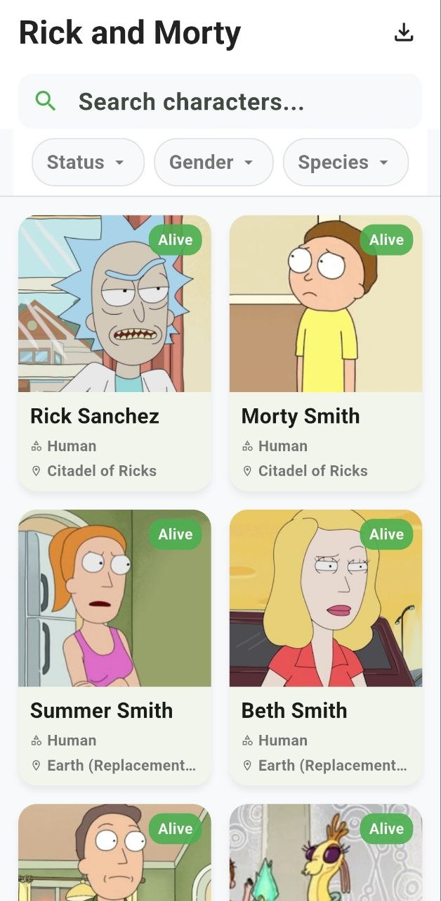

# Rick & Morty Explorer 🛸

A Flutter application that browses, searches, filters, and exports characters from the [Rick and Morty API](https://rickandmortyapi.com/documentation)

## 📱 Project Description

Rick & Morty Explorer lets users:

- Browse the full list of Rick and Morty characters with infinite-scroll pagination
- Search characters by name (debounced live search)
- Filter characters by **status**, **species**, and **gender**
- Export the currently loaded list of characters to an **Excel (.xlsx)** file and share it directly from the app
- See clear, dedicated UI states for **loading**, **empty results**, and **errors** (with retry)

The app is built with a strict **Clean Architecture** approach (presentation → domain → data), using **Cubit/Bloc** for state management and **get_it** for dependency injection — with no code generation (no Freezed, no build_runner).

---

## ✨ Features

| Feature | Description |
|---|---|
| Character list | Paginated grid view fetched from the Rick and Morty API |
| Search | Debounced search-by-name as you type |
| Filters | Filter by status (alive/dead/unknown), species, and gender |
| Export to Excel | One-tap export of the current character list to a `.xlsx` file, with native share sheet |
| State handling | Explicit loading, empty, error, and loading-more states — no silent failures |
| Responsive grid | Adaptive column count based on screen width |

---

## 🖼️ Screenshots

| Splash | Character List |
|---|---|
|  |  |

| Search | Filters |
|---|---|
|  |  |

| Export to Excel |
|---|
|  |

---

## 🎥 Demo Video

<video src="video.mp4" width="100%" controls></video>

---

## 🏗️ Architecture

The project follows a feature-first **Clean Architecture** structure:

```
lib/
├── app/                        # App widget, routing
├── core/                       # Shared code used across features
│   ├── api/                    # ApiService (Dio wrapper)
│   ├── di/                     # get_it dependency injection setup
│   ├── error/                  # ApiResult<T> & typed Failure classes
│   ├── export/                 # Excel export service
│   └── resources/               # Colors, routes, constants, assets
└── features/
    └── characters/
        ├── data/
        │   ├── datasources/     # Remote data source + exceptions
        │   ├── models/          # CharacterModel (JSON mapping)
        │   └── repositories/    # Repository implementations
        ├── domain/
        │   ├── entities/        # Character, PaginatedCharacters
        │   ├── repositories/    # Abstract repository contracts
        │   └── usecases/        # GetCharacters, ExportCharacters
        └── presentation/
            ├── cubit/            # CharactersCubit + sealed CharactersState
            ├── pages/            # CharactersPage
            └── widgets/          # Search bar, filter bar, grid, card, export button
```

**Key principles applied:**
- **Domain layer purity** — zero Flutter imports under `domain/`
- **Typed error handling** — data-layer exceptions are mapped to `Failure` subtypes and returned as `ApiResult<T>` (sealed union: `ApiSuccess` / `ApiFailure`), so failures flow predictably to the UI
- **Dependency Injection** — all Cubits, use cases, and repositories are resolved via `get_it`, never instantiated manually
- **State management** — `Cubit` + `sealed class` state unions with exhaustive `switch` expressions (Dart 3, no Freezed/build_runner)

---

## 🧰 Tech Stack & Packages

| Package | Purpose |
|---|---|
| `flutter_bloc` | State management (Cubit) |
| `dio` | HTTP client for the Rick and Morty API |
| `get_it` | Service locator / dependency injection |
| `excel` | Generating `.xlsx` files |
| `path_provider` | Resolving a writable directory for the exported file |
| `share_plus` | Sharing the exported Excel file |

---

## 🚀 Getting Started

### Prerequisites
- Flutter SDK (3.x)
- Dart 3+

### Run locally

```bash
git clone <your-repo-url>
cd <repo-folder>
flutter pub get
flutter run
```
